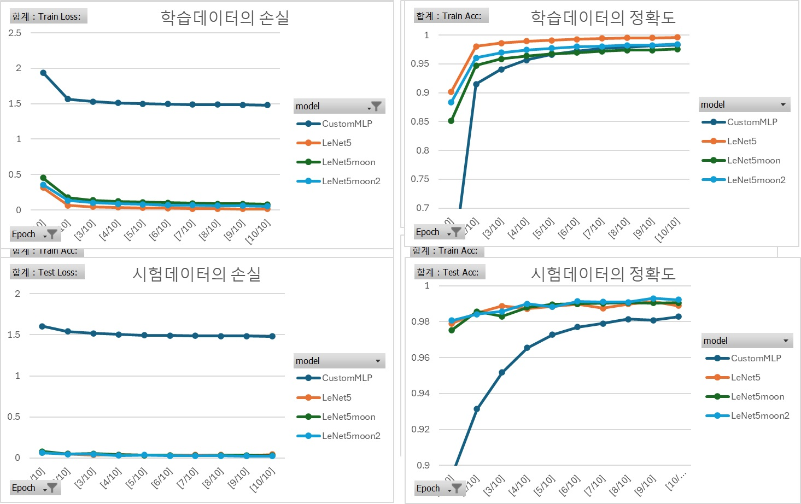

# MNIST Classification
In this report, I will describe the process of training LeNet-5 and a custom MLP (Multi-Layer Perceptron) on the MNIST dataset. The goal is to compare their predictive performances and explore regularization techniques to improve the LeNet-5 model.

### Class: Artificial Neural Network and Deep Learning, Seoul National University of Science&Technology
### Professor: [HWANG, SANGHEUM](https://iise.seoultech.ac.kr/about_the_department/about_professor/?togo=list&menu=1215&profidx=02533)
### Student: [HyeJung Moon](https://moonhyejung.github.io/), hyejung.moon@gmail.com, 23620026, 2024.04.16

## 1. Dataset Preparation: [dataset.py](https://github.com/MoonHyeJung/NN4DL/blob/main/dataset.py)
I implemented a custom MNIST dataset class in dataset.py. This class loads the MNIST images, applies necessary preprocessing (such as normalization), and provides data to the models during training and testing. The dataset contains handwritten digit images (28x28 pixels) along with their corresponding labels (0 to 9).
data download to C:\Users\userID\MNIST2024\data from eclass of SoulTech

## 2. Model Implementation: [model.py](https://github.com/MoonHyeJung/NN4DL/blob/main/model.py)
### LeNet-5
LeNet-5 is a classic convolutional neural network (CNN) architecture proposed by Yann LeCun et al. It consists of two convolutional layers followed by average pooling, and then three fully connected layers. The number of model parameters in LeNet-5 can be computed as follows:

reference: LeCun, Y., Bottou, L., Bengio, Y., & Haffner, P. (1998). Gradient-based learning applied to document recognition. Proceedings of the IEEE, 86(11), 2278-2324.

#### First Convolutional Layer:
- Input: 1 channel (grayscale image)
- Output: 6 feature maps
- Kernel size: 5x5
- Parameters: (5x5x1)x6 = 150
#### Second Convolutional Layer:
- Input: 6 feature maps
- Output: 16 feature maps
- Kernel size: 5x5
- Parameters: (5x5x6)x16 = 2400
#### Fully Connected Layers:
- First FC layer: 16x4x4 (flattened feature maps) -> 120 units
- Second FC layer: 120 -> 84 units
- Third FC layer: 84 -> 10 units (output classes)
- Parameters: (16x4x4)x120 + 120x84 + 84x10 = 61720

Total parameters in LeNet-5: 61720

### Custom MLP
I implemented a custom MLP with a similar number of parameters as LeNet-5. The architecture consists of three fully connected layers:

#### First Convolutional Layer:
- Input: 1 channel (grayscale image)
- Output: 6 feature maps
- Kernel size: 5x5
- Parameters: (5*5*1+1)*6 = 156
#### Second Convolutional Layer:
- Input: 6 feature maps
- Output: 16 feature maps
- Kernel size: 5x5
- Parameters: (5*5*6+1)*16 = 2416
#### Fully Connected Layers:
- First FC layer: 16x4x4 (flattened feature maps) -> 120 units
- Second FC layer: 120 -> 84 units
- Third FC layer: 84 -> 10 units (output classes)
- Parameters: (16x5x5)x120 + 120x84 + 84x10 = 123,412

Total parameters in Custom MLP: 123,412

## 3. Training Process: [main.py](https://github.com/MoonHyeJung/NN4DL/blob/main/main.py)
I wrote main.py to train both models.
The training process includes monitoring average loss values and accuracy at the end of each epoch.
I used the test dataset as a validation dataset during training.

## 4. Results
I plotted the following statistics for both models:
- Training loss and accuracy curves for each modes
- Test loss and accuracy curves for each modes

## 5. Performance Comparison
I compared the predictive performances of LeNet-5 and the custom MLP.
Additionally, I verified that the accuracy of my LeNet-5 implementation matches the known accuracy reported in the literature.

- added perforemance with new model by regularization

## 6. Regularization Techniques: [model.py](https://github.com/MoonHyeJung/NN4DL/blob/main/model.py)
### 6.1 LeNet5moon
- Increased depth: LeNet5moon has a deeper network structure. The added Convolutional Layer and Fully Connected Layer allow learning more abstract features, which improves model performance.
- Introducing Batch Normalization: LeNet5moon introduces Batch Normalization after each convolutional layer to stabilize learning and speed up convergence. This allows for more efficient learning.
- Apply Dropout: Add Dropout between Fully Connected Layers to prevent overfitting and improve the generalization ability of the model. This helps build more stable and generalized models.
- Architecture of LeNet5moon

Input (1, 32, 32)

| Layer          | Operation           | Output Shape |
|----------------|---------------------|--------------|
| Conv2d         | (1, 6, 5, 5)        | (6, 28, 28)  |
| BatchNorm2d    |                     |              |
| ReLU           |                     |              |
| MaxPool2d      | (2, 2)              | (6, 14, 14)  |
| Conv2d         | (6, 16, 5, 5)       | (16, 10, 10) |
| BatchNorm2d    |                     |              |
| ReLU           |                     |              |
| MaxPool2d      | (2, 2)              | (16, 5, 5)   |
| Flatten        |                     | (400,)       |
| Linear         | (400, 120)          | (120,)       |
| Dropout        | (p=0.5)             |              |
| Linear         | (120, 84)           | (84,)        |
| Dropout        | (p=0.5)             |              |
| Linear         | (84, 10)            | (10,)        |

When an input image comes in, it first passes through the Convolutional Layer. Afterwards, it goes through Batch Normalization and ReLU activation functions.
Next, we reduce the size of the image through the MaxPooling layer.
It goes through the convolutional layer again, and similarly applies Batch Normalization and ReLU.
Again reduce the image size through MaxPooling layer.
It is then expanded into a fully connected layer and the ReLU activation function is applied.
Afterwards, it goes through Dropout and passes through the Fully Connected Layer once again.
Finally, it passes through the output layer to get the score for each class.

### 6.2 LeNet5moon2
- Increased number of filters and feature maps: LeNet5moon2 can extract more features by using more filters in each convolutional layer. This allows for learning more diverse features and more accurate classification.
- Adjusted network size: LeNet5moon2 adjusts the network size according to the size of the input image to provide a more suitable model. This allows it to provide better generalization performance for different sizes and types of input images.
- Apply Batch Normalization: LeNet5moon2 also introduces Batch Normalization after each convolutional layer to stabilize learning and increase convergence speed. This allows for faster and more stable learning.
- Architecture of LeNet5moon2

Input (1, 32, 32)

| Layer          | Operation           | Output Shape |
|----------------|---------------------|--------------|
| Conv2d         | (1, 10, 5, 5)       | (10, 28, 28) |
| BatchNorm2d    |                     |              |
| ReLU           |                     |              |
| MaxPool2d      | (2, 2)              | (10, 14, 14) |
| Conv2d         | (10, 32, 5, 5)      | (32, 10, 10) |
| BatchNorm2d    |                     |              |
| ReLU           |                     |              |
| MaxPool2d      | (2, 2)              | (32, 5, 5)   |
| Flatten        |                     | (800,)       |
| Linear         | (800, 120)          | (120,)       |
| Dropout        | (p=0.5)             |              |
| Linear         | (120, 84)           | (84,)        |
| Dropout        | (p=0.5)             |              |
| Linear         | (84, 10)            | (10,)        |

When an input image comes in, it goes through a similar process as LeNet5moon.
After passing the convolutional layer, batch normalization, and ReLU, MaxPooling is applied to reduce the image.
Once again, we go through the Convolutional Layer, Batch Normalization, and ReLU and apply MaxPooling.
Expand to Fully Connected Layer and apply Dropout.
Once again, we go through the Fully Connected Layer to the output layer and get the scores for each class.

## Conclusion

### Implications 
I successfully trained LeNet5 and customMLP using the MNIST dataset, compared their performance, and displayed the results in a line graph and table.
As a result of running LeNet5 for 10 epochs, the performance reached more than 99% of the existing research(LeCun et al., 1998).
In addition, by adding depth increase, batch normalization, and dropout functions to the LeNet5 algorithm to create the LeNet5moon model, the accuracy of the test data was increased by 0.0017 from 0.9889 to 0.9906, but the execution time still took a long time.
To compensate for the slow speed, the LeNet5moon2 model was implemented by increasing the number of filters and feature maps, adjusting the network size, and applying batch normalization to LeNet5moon. As a result of the execution, the accuracy of the test data improved to 0.9807 for the first epoch and 0.9922 for the 10th epoch.

### Future works
When evaluating the performance of existing and new models, it would be good to not only compare loss and accuracy, but also compare execution time and memory usage under the same conditions, and see how performance changes depending on parameter changes. It would be nice to draw the structural diagram of the new model like a three-dimensional effect of LeCun et al. (1998).
